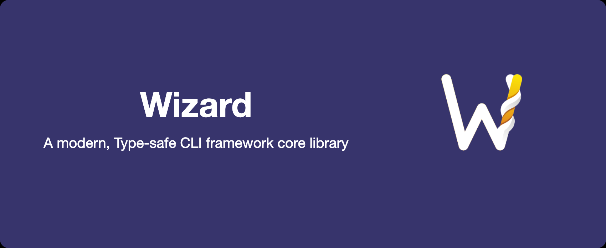

A modern, type-safe CLI framework built with TypeScript that provides powerful command-line tool.

  
  
  
  

## ✨ Features

- 🚀 Type Safety: Full TypeScript support, type-safe APIs, great DX
- 🌍 Internationalization: Built-in multi-language and easy locale switching
- 🔌 Plugin System: Flexible, extensible plugin architecture
- 🎯 Event-Driven: Event-based, async-ready, supports middleware
- 🛠️ Command Builder: Intuitive command definitions, subcommands, type inference
- 📝 Logging: Built-in multi-level logging, configurable output
- 🎨 Theme: Colored output, theme customization, cross-platform
- ⚡ Performance: Fast startup, efficient execution, low overhead

## 📖 Documentation

Please see [Wizard Documentation](https://wizard.hyperse.io)

## 🚀 Core Package

- **@hyperse/wizard** - Core library providing basic functionality and APIs

## 🧩 Plugin Ecosystem

Wizard provides a rich plugin ecosystem for common CLI functionality:

- **@hyperse/wizard-plugin-help** - Comprehensive help information plugin with customizable output formats
- **@hyperse/wizard-plugin-version** - Version information plugin with semantic versioning support
- **@hyperse/wizard-plugin-error** - Advanced error handling plugin with error recovery and reporting
- **@hyperse/wizard-plugin-loader** - Plugin loader with automatic discovery and dependency management

## 🔗 Related Projects

- [@hyperse/pipeline](https://github.com/hyperse-io/pipeline) - A powerful TypeScript middleware engine and reactive pipeline library that provides two main paradigms for handling data flow and middleware patterns.
- [type-flag](https://github.com/privatenumber/type-flag) - Strongly typed command-line arguments parser.

## License

This project is licensed under the [GPLv3 LICENSE](./LICENSE.md).
